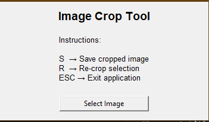
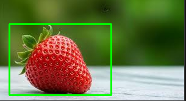

# 🖼️ Image Crop Tool

A **simple & interactive Image Cropping Tool** built with **Python**, **OpenCV**, and **Tkinter**! 🎨  
Crop your images in a few clicks without opening heavy software. Perfect for quick edits! ✂️

---

# ✨ Features

- 🖱️ **Interactive Cropping** – Draw a rectangle to select the area you want.  
- 🔍 **Live Preview** – See the crop in real-time before saving.  
- 💾 **Save Anywhere** – Save cropped images as **JPEG** or **PNG**.  
- 🔄 **Reset Anytime** – Re-crop without restarting the program.  
- ⌨️ **Keyboard Shortcuts**:

| Key | Action |
|-----|--------|
| S   | Save cropped image 💾 |
| R   | Reset selection 🔄 |
| ESC | Exit the app ❌ |


---

# 📸 Screenshots

**1. Main GUI:**  


**2. Drawing Rectangle:**  


**3. Cropped Image Preview:**  


---

# 🚀 Installation

## Prerequisites

- Python 3.8+ 🐍  
- Pip (Python package manager)  

## Required Libraries

Install via pip:

```bash
pip install opencv-python
pip install tk
```

---

# 🏃‍♂️ Usage

**1.** Clone the repository:

```bash
git clone https://github.com/faaiz-ahmed/Image-Crop-Tool.git
cd Image-Crop-Tool
```

**2.** Run the Python script:
```bash
python crop_tool.py
```

**3.** Click Select Image to load an image 🖼️.

**4.** Draw a rectangle with your mouse to select the crop area ✂️.

**5.** Use the keyboard shortcuts:

| Key | Action |
|-----|--------|
| S   | Save cropped image 💾 |
| R   | Reset selection 🔄 |
| ESC | Exit the app ❌ |

**6.** When you press **S**, a save dialog will appear—choose your location and filename.

**7.** Press **R** to reset and select a new crop area if needed.

**8.** Press **ESC** to exit the application.

---

# ⚙️ How It Works

**1.** Opens a file dialog to choose an image 🗂️.

**2.** Draw a rectangle using OpenCV mouse callbacks:

- Press and hold left mouse button → start drawing

- Move mouse → resize rectangle dynamically

- Release button → crop area selected

**3.** Crops and previews the selection dynamically.

**4.** Press S to save the cropped image 💾.

---

# 📂 Project Structure
Image-Crop-Tool/

│

├─ crop_tool.py        # Main Python script

├─ README.md           # Project documentation

├─ screenshots/        # Screenshots folder for README

---

# 🌟 Contribution

**1.** Fork the repo 🍴

**2.** Create a branch: git checkout -b feature/YourFeature 🌱

**3.** Make your changes ✍️

**4.** Commit: git commit -m "Add some feature" ✅

**5.** Push: git push origin feature/YourFeature 🚀

**6.** Open a Pull Request 🔗

---

## License 
📜 This project is open source and available under the [MIT](https://choosealicense.com/licenses/mit/)

---

## Author 
**Faaiz Ahmed** [GitHub Profile](https://github.com/faaiz-ahmed) 

---

## 💡 Tips

Use small-to-medium size images for smoother cropping

Adjust the rectangle before releasing the mouse for perfect crops

Supports JPEG and PNG formats
